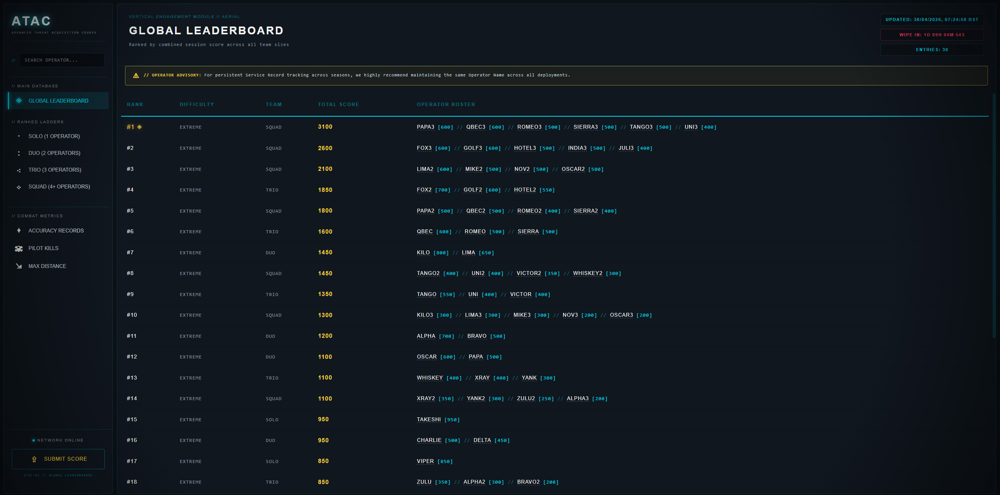

### ADVANCED THREAT ACQUISITION COURSE
**GLOBAL LEADERBOARD & COMBAT METRICS DATABASE**

---

> **WARNING // RESTRICTED ACCESS**
> You are accessing the global tracking database for the ATAC-01 Vertical Engagement Module. All operator statistics, deployment histories, and combat metrics are logged and archived bi-weekly.

  

## ◈ SYSTEM OVERVIEW

The ATAC-01 Database is a fully automated, serverless leaderboard architecture designed to track, verify, and display high-level operator performance in real-time. Built specifically to parse encrypted hashes generated from in-game Arma 3 terminals, this system ensures absolute data integrity while providing a sleek, tactical interface for operators to track their combat careers.

## ⌖ KEY FEATURES

* **The "Invisible Bouncer" Security:** A custom backend intercepts raw Arma 3 hashes, validates structure and uniqueness, and instantly rejects duplicate or malformed submissions before they ever touch the database.
* **Automated 14-Day Seasons:** An automated cron-trigger sweeps the active ladder, permanently backs up the data to a secure archive, and wipes the public database clean every 14 days to initiate a new tournament cycle.
* **Interactive Service Records:** Operators can click on any name on the board to pull up a secure Career Dossier-a live-calculated aggregation of their deployments, highest scores, confirmed pilot kills, max engagement distances, and average accuracy across all seasons.

## 🎖️ DYNAMIC THREAT TIERS

Elite operators are automatically assigned classification UI glows based on their all-time career statistics. Tiers are checked in priority order - the highest qualifying tier is awarded.

| TIER | COLOUR | REQUIREMENT |
|:---:|:---:|:---|
| ◈ **DIAMOND** | Hyper-Cyan | 80%+ avg accuracy **AND** 1000m+ max distance **AND** 10+ deployments |
| ◈ **EMERALD** | Green | 100+ career pilot kills |
| ◈ **PINK** | Magenta | 1000m+ career max distance |
| ◈ **GOLD** | Gold | 70%+ career avg accuracy |
| ◈ **VETERAN** | Steel Blue | 15+ total deployments |
| ◈ **STANDARD** | White/Silver | Baseline operator service record |

Each operator's Career Dossier also displays live progress bars toward every threshold, so operators always know exactly what they need to unlock the next classification.

## ⚙ ARCHITECTURE

This application operates on a zero-maintenance, highly scalable tech stack:
* **Frontend:** Pure HTML/CSS/JS. Styled with a custom "Tactical CRT" CSS engine featuring zero-CPU-cost scanlines, dynamic glass-panel modals, and real-time search filtering.
* **Backend:** Google Apps Script Web App acting as a secure REST API and automated timeline manager.
* **Database:** Google Sheets (Dual-table schema utilizing live `Submissions` and permanent `Archive` tables).
* **Data Parsing:** `PapaParse.js` utilized for real-time asynchronous CSV streaming directly to the client browser.

## ⇪ SECURE UPLINK INSTRUCTIONS

1. Complete your ATAC-01 run in-game.
2. Copy the encrypted `ATAC_03|...` hash string from the post-mission terminal.
3. Navigate to the **Data Uplink Portal** on the live site.
4. Transmit the hash. The server will decrypt, verify, and log your metrics within 3.5 seconds.

---

<i>"Ensure your Operator Name matches previous entries to maintain your career Service Record."</i> 
<b>© 2026 ATAC-01 // ALL RIGHTS RESERVED</b>  

// THE ATAC-01 PROJECT WAS BROUGHT TO LIFE WITH ASSISTANCE FROM CLAUDE

